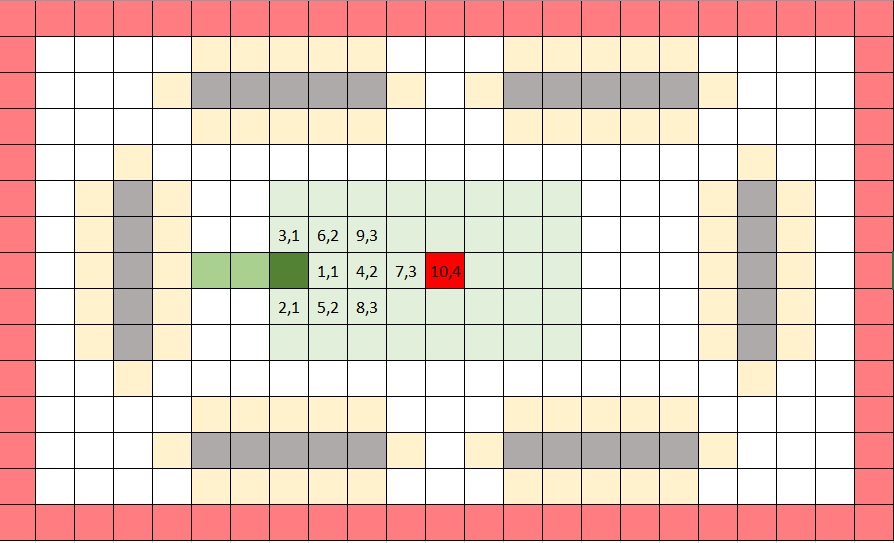

# **Giới thiệu bài Project cuối kỳ môn trí tuệ nhân tạo nhóm 9**

## Thành viên nhóm 9:
Lưu Quang Tiến - 23110157\
Trần Cẩm Long - 23110122

## **Mục tiêu của Project**
Bài Project cuối kỳ thực hiện xây dựng game Snakes! bằng ngôn ngữ Python nhằm mục đích biểu diễn cách ứng dụng các thuật toán đã được học trong việc tìm kiếm đường đi ngắn nhất để tìm mục tiêu. Từ đó tìm ra thuật toán nào phù hợp, tối ưu nhất trong việc tìm kiếm đường đi ngắn nhất đến mục tiêu trong trò chơi.

## **Mục lục**
Trong phần giới thiệu của Project, chúng em sẽ nói qua về những chủ đề sau:
- [Thư viện](#Thư-viện)
- [Giới thiệu game](#Giới-thiệu-game-Snakes!)
- [Lý thuyết, nguyên lý thuật toán](#Lý-thuyết,-nguyên-lý-cơ-bản-của-thuật-toán.)
- [Demo các thuật toán](#demo-các-thuật-toán)
- [Ưu điểm, nhược điểm](#ưu-điểm-nhược-điểm)
- [Kết luận](#kết-luận)

## *Thư viện*
Trong quá trình xậy dựng game, nhóm có sử dụng những thư viện không có sẵn trong python:
- pygame: thư viện cốt lõi trong quá trình thực hiện Project, cung cấp những công cụ để tạo GUI và thực hiện vòng lặp để game hoạt động.
- openpyxl: thư viện cung cấp công cụ giúp xuất dữ liệu trong quá trình sử dụng thuật toán để chạy game tự động.

## *Giới thiệu game Snakes!*
Lý do nhóm 9 lựa chọn game Snakes! hay thường biết đến là "Rắn săn mồi" là vì đây là một trò chơi phổ biến và khá quen thuộc đối với nhiều người, đồng thời cũng rất dễ để hiểu được quy trình tìm đường đi của con rắn đến thức ăn.

Luật chơi của Snakes! rất đơn giản. Người chơi điều khiển con rắn di chuyển theo 4 chiều, tương ứng với 4 nút chỉ hướng trên bàn phím, giúp con rắn ăn được quả táo để nó dài ra và giúp con rắn tránh va chạm vào các chướng ngại vật (tường, lề màn hình, và quan trọng nhất là cơ thể con rắn).

## *Lý thuyết, nguyên lý cơ bản của thuật toán*

### BFS
Thuật toán quét cạn bắt đầu từ đầu con rắn đến quả táo. Con rắn sẽ quét cạn bắt đầu từng lớp, kiểm tra đã đến đích chưa, sau đó sinh ra các trạng thái (ô) con an toàn với hàm snake.Is_safe() rồi đưa vào hàng đợi nếu chưa được duyệt qua. Sau khi tìm kiếm được mục tiêu, thuật toán sẽ xây dựng lại đường đi từ quả táo đến đầu con rắn để dẫn đường cho nó di chuyển.
Độ phức tạp trường hợp xấu nhất:
- Không gian: 24 x 15 - 30 = 330
- Thời gian: 24 x 15 - 30 = 330

### DFS
Thuật toán tìm kiếm theo chiều sâu bắt đầu từ đầu con rắn đến quả táo. Con rắn sẽ kiểm tra đã đến đích chưa, sau đó sinh ra các trạng thái (ô) con an toàn với hàm snake.Is_safe() rồi đưa vào hàng đợi nếu chưa được duyệt qua. Các ô con được duyệt qua theo FIFO (First in first out), khác với BFS quét cạn, DFS tìm kiếm theo nhánh sâu. Sau khi tìm kiếm được mục tiêu, thuật toán sẽ xây dựng lại đường đi từ quả táo đến đầu con rắn để dẫn đường cho nó di chuyển.
Độ phức tạp trường hợp xấu nhất:
- Không gian: 360
- Thời gian: 360

### UCS
Giống với BFS, thuật toán UCS cũng sử dụng phương thức quét cạn. Nhưng UCS khác biệt ở việc kèm theo chi phí g(n) cho các trạng thái. Môi trường game được đặt những khu vực với các mức độ "nguy hiểm" (+0, +1, +2, +3) và từ đó quyết định được đường đi cuối dùng ngắn và an toàn nhất cho con rắn.
Độ phức tạp trường hợp xấu nhất:
- Không gian: 360
- Thời gian: 360log(360)

## Greedy
Khác với những thuật toán trước, Greedy sử dụng heuristic h(n) để tìm đường đi tốt nhất tại thời điểm đó và đi đến quả táo. Trong Project, heuristic được kết hợp giữa 3 hàm tính toán. Flood fill từ quả táo đến đầu con rắn, Flood fill từ đuôi con rắn đến đầu con rắn giúp rắn tránh việc tự kẹt mình (bằng cách đuổi theo đuôi) và Flood fill để phạt con rắn khi nó đi vào những vị trí hẹp có thể làm nó bị kẹt.
Độ phức tạp trường hợp xấu nhất:
- Không gian: 360
- Thời gian: 360log(360)

### Beam search

### Simulated annealing

### Không gian không nhìn thấy

### Không gian nhìn thấy một phần

### Backtracking

### AC3

## *Demo các thuật toán*

### BFS

### DFS

### UCS

### Greedy

### Beam search

### Simulated annealing

### Không gian nhìn thấy một phần

### Backtracking

## *Ưu điểm, nhược điểm*
## **Kết luận**
